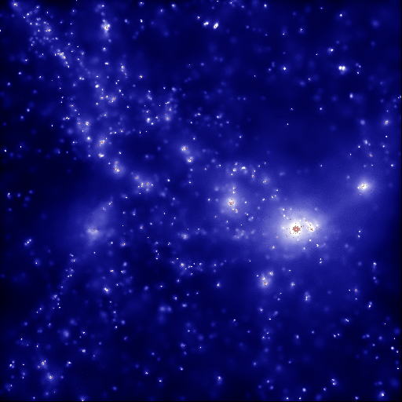

# 結果
  

---

# 結構
:file_folder:**direct_hiding**  
  L:file_folder:**text_source** : contains text files  
  L:file_folder:**out** : contains output images  
  L:file_folder:**images** : original images  

---

#
